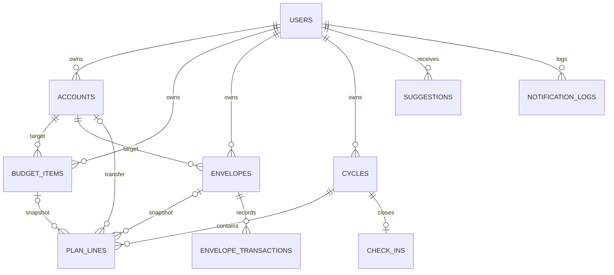

# ERD — 월급 배분 관리 서비스

| 문서 버전 | v1.1 |
|---|---|
| 작성일 | 2026-06-11 |
| 관련 문서 | 요구사항정의서.md (v1.2), 월급관리앱_개발계획.md |

### 버전 이력
| 버전 | 일자 | 변경 내용 |
|---|---|---|
| v1.0 | 2026-06-11 | 최초 작성 |
| v1.1 | 2026-06-11 | check_ins.topped_up 추가, plan_lines.account_id 추가, cycles.income_confirmed 추가, users.living_account_id 추가(생활비 이체 라인 설계 공백 해소), LIVING 카테고리 의미 정리 |
| v1.2 | 2026-06-11 | 관계도에 ACCOUNTS–PLAN_LINES 추가, EMERGENCY 집계 위치는 API명세에 정의(폭포 groups 제외, split 집계) |

## 1. 관계도

설계 축: `budget_items`·`envelopes`는 **현재 상태**만 보유하고, `cycles`·`plan_lines`·`check_ins`가 **역사**를 불변 스냅샷으로 보존한다. `holidays`는 전역 참조 테이블로 사용자와 관계가 없다.

## 2. 테이블 명세

### users — 사용자
| 컬럼 | 타입 | 제약 | 설명 |
|---|---|---|---|
| id | bigint | PK | |
| provider | varchar | NN | KAKAO / GOOGLE / NAVER |
| provider_id | varchar | NN | 공급자 발급 고유 ID |
| email | varchar | NULL | 동의 거부 시 미수집 |
| nickname | varchar | NN | |
| base_income | bigint | NN | 평소 실수령액(원) |
| payday | smallint | NN | 1~31. 해당 월에 없으면 말일 간주 |
| payday_adjustment | varchar | NN | PREV_BUSINESS_DAY(기본) / NEXT_BUSINESS_DAY / NONE |
| include_investment_in_savings_rate | boolean | NN, default true | 저축률에 투자 포함 |
| locale | varchar | NN, default 'ko' | ko / en |
| living_account_id | bigint | FK→accounts, NULL | 생활비(나머지)가 이체될 통장. 지정 시 스냅샷에 LIVING 라인 생성 |
| created_at | timestamptz | NN | |

제약: `unique(provider, provider_id)`. 탈퇴 시 하위 데이터 전체 cascade 삭제.

### accounts — 통장
| 컬럼 | 타입 | 제약 | 설명 |
|---|---|---|---|
| id | bigint | PK | |
| user_id | bigint | FK→users | |
| name | varchar | NN | 별칭(예: 케이뱅크). 계좌번호 등 금융 식별 정보 저장 금지 |
| purpose | varchar | NULL | 용도 메모 |
| bank_deep_link | varchar | NULL | 은행 앱 딥링크 |
| sort_order | int | NN | |
| is_active | boolean | NN, default true | soft delete |

### budget_items — 배분 항목
| 컬럼 | 타입 | 제약 | 설명 |
|---|---|---|---|
| id | bigint | PK | |
| user_id | bigint | FK→users | |
| account_id | bigint | FK→accounts | 대상 통장 |
| category | varchar | NN | SAVING / INVESTMENT / FIXED / INSURANCE / SUBSCRIPTION / EMERGENCY. LIVING은 항목용으로 미사용 — 생활비는 항상 폭포의 나머지 계산값이며 이체처는 users.living_account_id로 지정 |
| name | varchar | NN | |
| amount | bigint | NN | 월 환산 금액(원) — 폭포·스냅샷의 기준값 |
| input_cycle | varchar | NN, default 'MONTHLY' | MONTHLY / DAILY |
| input_meta | jsonb | NULL | 원본 입력 보존: 일 금액, 통화, 매일/영업일, 기준 환율, 버퍼율 |
| start_date | date | NN | |
| end_date | date | NULL | 만기일. 도래 시 배치가 ARCHIVED 전환 |
| interest_rate | numeric(5,2) | NULL | 연이율(%) |
| tax_type | varchar | NULL | NORMAL(15.4%) / PREFERENTIAL / TAX_FREE |
| expected_maturity_amount | bigint | NULL | 특수 상품(청년도약 등) 수동 입력값. 있으면 공식 계산 대신 사용 |
| maturity_actual_amount | bigint | NULL | 만기·해지 시 실수령액 기록 |
| memo | text | NULL | |
| sort_order | int | NN | |
| status | varchar | NN | ACTIVE / ARCHIVED(만기) / DELETED(soft delete, ITEM-09) |
| created_at / updated_at | timestamptz | NN | |

인덱스: `(user_id, status)`.

### envelopes — 봉투
| 컬럼 | 타입 | 제약 | 설명 |
|---|---|---|---|
| id | bigint | PK | |
| user_id | bigint | FK→users | |
| account_id | bigint | FK→accounts | 적립 통장 |
| name | varchar | NN | |
| target_amount | bigint | NN | |
| saved_amount | bigint | NN, default 0 | 트랜잭션 합계의 캐시값 |
| next_due_date | date | NN | 다음 지출일 |
| cycle_months | smallint | NULL | 반복 주기(개월). NULL = 일회성 |
| memo | text | NULL | |
| status | varchar | NN | ACTIVE / CLOSED / DELETED |
| created_at | timestamptz | NN | |

월 적립액은 컬럼이 아니라 계산값: `(target_amount − saved_amount) ÷ 잔여 개월`. 건너뛰기 후 재계산은 이 구조가 자동 흡수한다.

### envelope_transactions — 봉투 적립/지출 기록
| 컬럼 | 타입 | 제약 | 설명 |
|---|---|---|---|
| id | bigint | PK | |
| envelope_id | bigint | FK→envelopes | |
| type | varchar | NN | DEPOSIT / SPEND |
| amount | bigint | NN | 계획 금액 |
| actual_amount | bigint | NULL | SPEND 시 실제 지출액 |
| shortfall_source | varchar | NULL | 부족 충당 출처: LIVING / EMERGENCY |
| carry_over | boolean | NULL | 잉여분 이월 여부 |
| cycle_id | bigint | FK→cycles, NULL | 어느 사이클의 기록인지 |
| occurred_on | date | NN | |
| created_at | timestamptz | NN | |

### cycles — 사이클(월 계획 스냅샷)
| 컬럼 | 타입 | 제약 | 설명 |
|---|---|---|---|
| id | bigint | PK | |
| user_id | bigint | FK→users | |
| cycle_start | date | NN | 실제 지급일(조정 반영) |
| cycle_end | date | NN | 다음 지급일 전날 |
| label | varchar | NN | 시작 월 기준(예: "2026-06") |
| income | bigint | NN | 확인된 실수령액. 기본값 base_income |
| income_confirmed | boolean | NN, default false | 체크리스트에서 실수령액 확인 여부(CYCLE-04) |
| created_at | timestamptz | NN | |

제약: `unique(user_id, cycle_start)` — 스냅샷 생성 멱등성(NFR-05). 생성 후 불변, 수정은 plan_lines 재생성으로만.

### plan_lines — 사이클 배분 라인
| 컬럼 | 타입 | 제약 | 설명 |
|---|---|---|---|
| id | bigint | PK | |
| cycle_id | bigint | FK→cycles | |
| line_type | varchar | NN | ITEM / ENVELOPE / LIVING(나머지 이체) / EXTRA(여윳돈 배분) |
| budget_item_id | bigint | FK→budget_items, NULL | 원본 참조(끊겨도 무방) |
| envelope_id | bigint | FK→envelopes, NULL | |
| account_id | bigint | FK→accounts, NULL | 이체 대상 통장 — 체크리스트 group by 기준. 통장은 soft delete라 참조 유지 |
| name_snapshot | varchar | NN | 생성 시점 이름 복사 |
| category_snapshot | varchar | NN | 생성 시점 카테고리 복사 |
| account_name_snapshot | varchar | NN | 생성 시점 통장 별칭 복사 |
| planned_amount | bigint | NN | 생성 시점 금액 복사 |
| status | varchar | NN | PENDING / DONE / SKIPPED |
| checked_at | timestamptz | NULL | |

스냅샷 컬럼(name/category/account/amount)이 값을 복사 보유하므로 원본 항목의 수정·삭제에 영향받지 않는다(ITEM-07, ITEM-09). 체크리스트 화면은 이 테이블을 account_id 기준 group by한 결과다. LIVING 라인은 스냅샷 생성 시 폭포 나머지 계산값으로 1건 생성되며(users.living_account_id 지정 시), 여윳돈 반영 등으로 재계산이 필요하면 미완료 상태일 때만 갱신한다.

### check_ins — 월말 체크인
| 컬럼 | 타입 | 제약 | 설명 |
|---|---|---|---|
| id | bigint | PK | |
| cycle_id | bigint | FK→cycles, unique | 사이클당 1건 |
| living_remaining | bigint | NN | 입력: 생활비 통장 잔액 |
| topped_up | bigint | NN, default 0 | 입력(선택): 사이클 중 생활비에 추가 투입한 금액 |
| overspend | bigint | NN | 계산 저장: topped_up − living_remaining (양수=초과, 음수=잉여) |
| note | text | NULL | |
| created_at | timestamptz | NN | |

미수행 사이클은 행 자체가 없음 = 결측(예외 흐름 5.1). 리포트·제안 산정에서 제외.

### suggestions — 보정/리밸런싱 제안
| 컬럼 | 타입 | 제약 | 설명 |
|---|---|---|---|
| id | bigint | PK | |
| user_id | bigint | FK→users | |
| type | varchar | NN | RAISE_LIVING / REBALANCE_MATURITY / WINDFALL ... |
| payload | jsonb | NN | 구조화 파라미터(SUG-03). 문장은 클라이언트가 조립 |
| status | varchar | NN | PENDING / APPLIED / DISMISSED |
| created_at / resolved_at | timestamptz | | |

### notification_logs — 알림 발송 기록
| 컬럼 | 타입 | 제약 | 설명 |
|---|---|---|---|
| id | bigint | PK | |
| user_id | bigint | FK→users | |
| type | varchar | NN | PAYDAY / ENVELOPE_DUE / CHECK_IN / MATURITY ... |
| target_date | date | NN | 알림 대상일 |
| channel | varchar | NN | EMAIL / WEB_PUSH / FCM |
| sent_at | timestamptz | NN | |

제약: `unique(user_id, type, target_date)` — 중복 발송 차단(NOTI-04).

### holidays — 공휴일 캐시 (전역)
| 컬럼 | 타입 | 제약 | 설명 |
|---|---|---|---|
| id | bigint | PK | |
| holiday_date | date | unique | |
| name | varchar | NN | |
| source_year | smallint | NN | 수집 기준 연도 |

공공데이터포털 특일 API 연 1회 수집. 차년도 미수신·장애 시 PaydayResolver는 주말 회피만 수행(CYCLE-01).

## 3. 설계 결정 요약

1. **현재/역사 분리** — budget_items·envelopes는 현재만, plan_lines가 값 복사로 역사 보존. 원본 수정·soft delete가 과거 리포트를 깨지 않는다.
2. **soft delete** — accounts.is_active, budget_items.status=DELETED, envelopes.status=DELETED. 물리 삭제는 회원 탈퇴 cascade뿐.
3. **멱등 제약** — cycles unique(user_id, cycle_start), notification_logs unique(user_id, type, target_date), check_ins unique(cycle_id).
4. **계산값 비저장 원칙** — 봉투 월 적립액, 적금 예상 만기금액, 폭포 잔액은 컬럼이 아닌 도메인 함수. 단 check_ins.overspend는 입력 시점 계획값에 의존하므로 계산 후 저장.
5. **금융 식별 정보 무저장** — 계좌번호·카드번호 컬럼 자체가 없다(NFR-01).
6. **시간대** — 모든 date 판정은 Asia/Seoul 기준(NFR-04). timestamptz는 저장용, 비즈니스 날짜는 date 타입.
