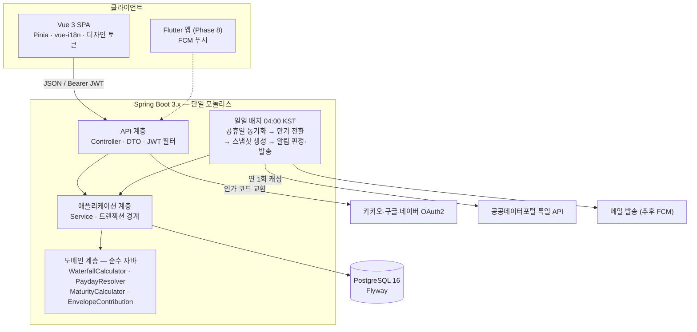
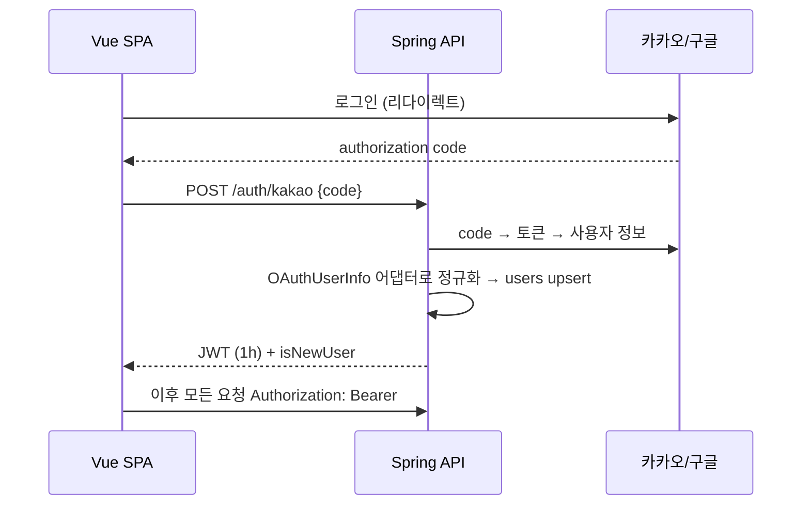
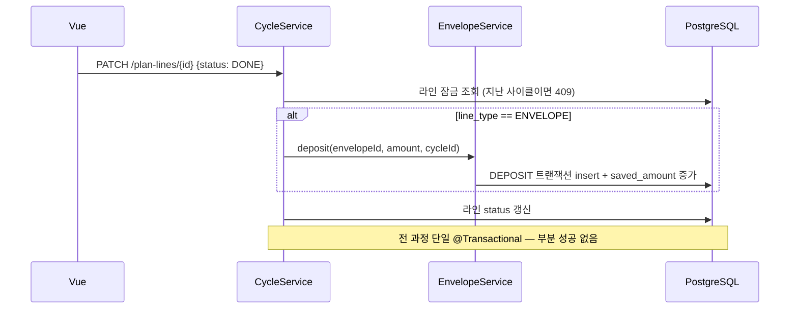

# 아키텍처 — 월급 배분 관리 서비스

| 문서 버전 | v1.0 |
|---|---|
| 작성일 | 2026-06-11 |
| 관련 문서 | ERD.md (v1.2), 구현규칙.md, CLAUDE.md, API명세초안.md |

## 1. 시스템 구성도



단일 VM 위의 모놀리스 + SPA. 분리·확장은 의도적으로 하지 않는다(9장 ADR-01).

## 2. 백엔드 계층 구조

레이어드 아키텍처에 **도메인 순수성 한 가지 규칙**을 얹는다. 완전한 헥사고날(전 영역 포트/어댑터)은 1인 프로젝트에 과하므로 채택하지 않고, 대신 "돈 계산 로직은 어떤 프레임워크도 모른다"는 규칙만 ArchUnit으로 기계 강제한다.

| 계층 | 책임 | 의존 가능 대상 |
|---|---|---|
| api | HTTP 입출력, DTO 변환, 인증 필터 | application |
| application | 유스케이스 오케스트레이션, @Transactional 경계, JPA 리포지토리 호출 | domain, infra |
| domain | **순수 계산·정책.** Spring 의존 금지(ArchUnit 강제), Clock·값 객체만 받는 결정론적 코드 | (없음) |
| infra | JPA 리포지토리, 외부 클라이언트(공휴일 API, 메일), 배치 트리거 | application 호출(배치), domain 사용 |

**JPA 엔티티의 위치(중요한 실용 결정, v1.1 개정)** — JPA 엔티티는 각 기능 패키지의 `infra`에 둔다. `domain`은 계산기·정책 등 **완전 순수 클래스만** 보유하며, ArchUnit이 `..domain..`에서 spring·jakarta·hibernate·jackson 의존을 전부 차단한다(하네스 키트의 ArchitectureTest 기준). 계산기는 엔티티가 아닌 입력 전용 값 객체(record)를 받고, application 계층이 엔티티↔값 객체 변환을 담당한다. (초안에서는 엔티티를 domain에 두고 jakarta만 허용했으나, 강한 규칙 + 엔티티 분리가 골든 테스트 과녁을 더 선명하게 하므로 개정.)

**도메인 계산기 목록** — 전부 정적이거나 무상태, 단위 테스트·골든 fixture의 대상:
- `WaterfallCalculator` — 폭포 캐스케이드, split, overAllocated 판정 (구현규칙 1·API명세 3장)
- `PaydayResolver` — 실제 지급일 산출, 사이클 구간 계산 (CYCLE-01~02)
- `MaturityCalculator` — 적금 만기금액 단리·세금 (ITEM-05)
- `EnvelopeContributionCalculator` — 월할 적립액 올림 계산 (구현규칙 1장)
- `FxRecommendationCalculator` — 외화 권장 이체액 (ITEM-04)
- `SuggestionPolicy` — 보정 제안 발동 룰 (구현규칙 7장)

## 3. 패키지 구조

기능(도메인) 우선으로 자르고, 각 기능 안에서 계층으로 나눈다. 기능 간 직접 참조는 application 계층끼리만 허용.

```
com.{이름}.salary
├── common/            # ErrorCode, ApiException, KST Clock 설정, 공통 응답 포맷
├── auth/              # OAuth2 성공 핸들러, JWT 발급·필터, OAuthUserInfo 어댑터 3종
├── user/              # 프로필·설정 (payday, living_account_id, locale ...)
├── account/
├── budgetitem/        # 항목 CRUD + MaturityCalculator, FxRecommendationCalculator
│   ├── api/
│   ├── application/
│   ├── domain/
│   └── infra/
├── envelope/          # 봉투 + EnvelopeContributionCalculator + 지출 처리
├── cycle/             # 사이클·스냅샷·plan_lines·체크리스트 + PaydayResolver, WaterfallCalculator
├── checkin/           # 월말 체크인
├── suggestion/        # 제안 생성·반영 + SuggestionPolicy
├── notification/      # NotificationSender 포트(EMAIL 구현, 추후 FCM), 발송 로그
├── holiday/           # 특일 API 클라이언트, 캐시
└── batch/             # DailyBatchRunner — 아래 4장
```

`cycle`이 가장 무거운 패키지다(스냅샷 생성·재생성·LIVING 라인). budgetitem·envelope에 의존하므로 순환을 막기 위해 cycle → 타 기능 방향만 허용한다(ArchUnit 후보 규칙).

## 4. 일일 배치

스케줄러는 `@Scheduled(cron, zone="Asia/Seoul")` 단일 인스턴스. Quartz·Spring Batch는 채택하지 않는다(ADR-04). 모든 단계는 멱등이라 재실행·중복 실행에 안전하고, 실패 단계는 다음날 자연 복구된다.

```
DailyBatchRunner (04:00 KST)
 1. HolidaySyncStep        — 캐시에 차년도 없고 11월 이후면 특일 API 수집
 2. MaturityArchiveStep    — end_date 경과 항목 ARCHIVED + REBALANCE_MATURITY 제안 생성(D-30 선행 단계 포함)
 3. CycleSnapshotStep      — 오늘이 실제 지급일인 사용자 → 스냅샷 생성 (unique 제약으로 멱등)
 4. NotificationStep       — 오늘 기준 PAYDAY / ENVELOPE_DUE / CHECK_IN 대상 판정 → 발송 → notification_logs 기록
```

각 스텝은 독립 try-catch — 한 스텝 실패가 다음 스텝을 막지 않는다. 알림 발송과 로그 기록은 같은 트랜잭션이 아니라 "기록 먼저, 발송 후 확정" 순서로 중복 발송을 차단한다(NOTI-04).

## 5. 핵심 흐름

### 5.1 인증 (스테이트리스 JWT)



세션 없음. 만료 시 재로그인(리프레시 토큰은 v1 생략, ADR-03).

### 5.2 체크리스트 DONE → 봉투 적립 (정합성의 급소)



DONE 해제는 역방향(DEPOSIT 삭제)이며, 이후 SPEND 존재 시 `LINE_LOCKED_BY_SPEND`로 거부(구현규칙 2장).

### 5.3 폭포 조회

읽기 전용 경로: Controller → CycleService가 ACTIVE 항목·봉투를 조회 → `WaterfallCalculator.calculate(입력 값 객체)` → 응답 DTO. 계산기는 DB를 모르고, 같은 입력이면 같은 출력 — 골든 fixture가 이 함수를 직접 겨눈다.

## 6. 프론트엔드 구조

```
src/
├── api/           # axios 인스턴스(JWT 인터셉터, 에러코드→i18n 매핑), 도메인별 모듈
├── stores/        # Pinia: auth, waterfall, cycle, envelope, report
├── views/         # SCR-01~08 (라우트 1:1)
├── components/
│   ├── base/      # Card, MoneyText, BottomSheet, ProgressBar, BottomNav, AmountInput
│   └── domain/    # WaterfallList, ChecklistCard, EnvelopeCard ...
├── composables/   # useCountUp, useMoneyFormat, useCycleLabel
├── locales/       # ko.json (en.json은 키만)
└── styles/        # tokens.css — 화면설계.html의 토큰과 1:1
```

원칙: 서버 응답은 구조화 데이터이므로 **문장 조립은 전부 프론트**(에러·제안 모두). 상태는 화면 단위가 아니라 도메인 단위 스토어로 — 홈과 리포트가 같은 cycle 스토어를 공유한다.

## 7. 인프라·배포

```
[GitHub] --push--> [Actions: verify → 이미지 빌드 → ghcr push → SSH 배포]
                                                        |
[Oracle Cloud VM]  docker compose:
  nginx (정적 Vue + /api 리버스 프록시 + Let's Encrypt)
  app   (Spring Boot, 환경변수로 시크릿 주입)
  postgres (볼륨) ── 매일 pg_dump → 오브젝트 스토리지 (NFR-03)
```

- 로컬과 운영이 같은 compose 파일 구조(오버라이드만 분리) — 환경 차이로 인한 버그 차단
- CI의 verify는 로컬 `./gradlew verify` / `npm run verify`와 동일 명령 — 드리프트 금지(하네스)
- 시크릿(.env)은 저장소에 커밋 금지, VM에만 존재. 비용 목표 월 1만원 이하(NFR-09)

## 8. 횡단 관심사

| 관심사 | 방식 |
|---|---|
| 시간 | `Clock` 빈(KST) 단일 주입. 도메인 계산기는 날짜를 파라미터로만 받음 |
| 에러 | `ApiException(ErrorCode)` → @RestControllerAdvice에서 `{code, params}` 변환 |
| 소유권 | 모든 조회·수정은 `userId` 조건 포함 — Service 공통 헬퍼로 강제 |
| 로깅 | 요청 ID + userId 구조화 로그. 금액·개인 데이터는 로그 금지 |
| 멱등 | DB unique 제약을 1차 방어선으로, 코드의 존재 검사는 2차 |

## 9. 아키텍처 결정 기록 (ADR 요약)

| # | 결정 | 이유 | 트레이드오프(수용) |
|---|---|---|---|
| 01 | 단일 모놀리스 + 단일 VM | 1인 운영, 트래픽 미미, 배포·디버깅 단순 | 수평 확장 불가 — 필요해지는 날이 오면 성공한 것 |
| 02 | 레이어드 + 도메인 순수성만 강제 | 헥사고날 풀세트는 보일러플레이트 과다. 돈 계산만 격리하면 테스트 가치의 90% 확보 | 인프라 교체 유연성 일부 포기 |
| 03 | JWT 스테이트리스, 리프레시 생략 | 세션 저장소 불필요, Flutter 공유 용이 | 1시간마다 재로그인 — v1 사용자 규모에서 수용, 불편 확인 시 리프레시 추가 |
| 04 | @Scheduled (Quartz·Spring Batch 미채택) | 하루 1회·소규모 데이터에 분산 스케줄러는 과잉 | 다중 인스턴스 시 중복 실행 — 단일 VM 전제, 확장 시 ShedLock 추가 |
| 05 | 알림 채널만 포트(NotificationSender) | EMAIL→FCM 교체가 확정된 미래라 추상화 비용이 회수됨 | 다른 외부 연동은 직접 호출(추상화 안 함) |
| 06 | REST (GraphQL 미채택) | 화면-API가 1:1에 가깝고 Swagger 하네스와 결합 | 화면별 과소·과다 페치 — 응답을 화면 단위로 설계해 회피 |
| 07 | Pinia 도메인 스토어 | 홈·리포트·체크리스트가 같은 사이클 데이터 공유 | 스토어-API 동기화 규칙 필요(액션에서만 변이) |
| 08 | 마이그레이션은 Flyway 전진 전용 | 기존 V*.sql 수정 금지(훅으로 차단) — 운영 DB 안전 | 실수 수정도 새 버전으로 — 이력은 길어지지만 안전 |
| 09 | 단일 모듈 + 기능 우선 (계층별 멀티 모듈 미채택) | 참고한 사내 MES는 계층별 어셈블리 분리(Api/Application/Domain/Core)였으나, 그 구조는 다중 앱·다인 협업 전제. 단일 앱·1인에선 기능 폴더 수직 통합이 수정 동선·에이전트 작업에 유리하며, 의존 방향 강제는 ArchUnit으로 대체 | 컴파일 타임 강제 포기(테스트 타임으로) — 모듈 승격은 필요 시점에 |
