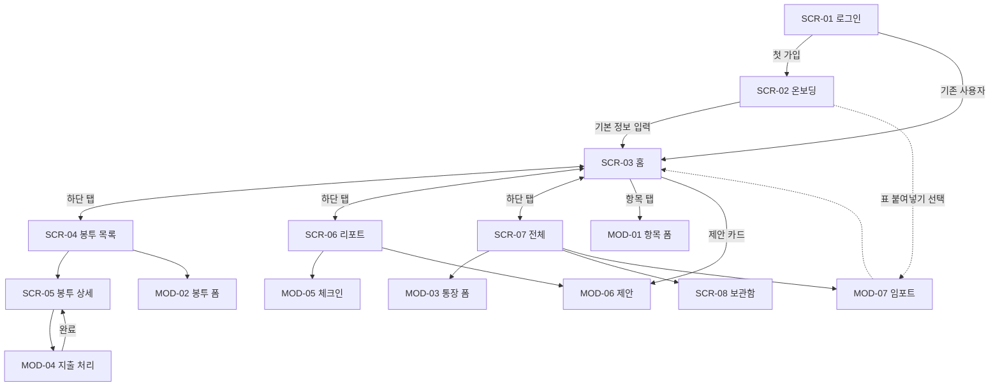

# 화면 흐름도 — 월급 배분 관리 서비스

| 문서 버전 | v1.0 |
|---|---|
| 작성일 | 2026-06-11 |
| 관련 문서 | 요구사항정의서.md (v1.1), ERD.md |

## 1. 화면 목록

### 페이지 (라우트)
| ID | 화면 | 라우트 | Phase | 관련 요구사항 |
|---|---|---|---|---|
| SCR-01 | 로그인 | /login | 0 | AUTH-01~03 |
| SCR-02 | 온보딩 | /onboarding | 1 | SET-01, ITEM-01 |
| SCR-03 | 홈(폭포) | / | 1 | FLOW-01~03, CYCLE-04, CYCLE-06 |
| SCR-04 | 봉투 목록 | /envelopes | 3 | ENV-01~03 |
| SCR-05 | 봉투 상세 | /envelopes/:id | 3 | ENV-03~05 |
| SCR-06 | 리포트 | /reports | 5 | RPT-01~03, SUG-02 |
| SCR-07 | 전체(허브) | /menu | 1 | SET-02~04 |
| SCR-08 | 보관함 | /archive | 4 | ITEM-08 |

### 모달/바텀시트
| ID | 화면 | 호출 위치 | Phase | 관련 요구사항 |
|---|---|---|---|---|
| MOD-01 | 항목 추가·수정 | SCR-03, SCR-07 | 1 | ITEM-01~07 |
| MOD-02 | 봉투 추가·수정 | SCR-04 | 3 | ENV-01 |
| MOD-03 | 통장 추가·수정 | SCR-07 | 1 | SET-04 |
| MOD-04 | 봉투 지출 처리 | SCR-05 | 3 | ENV-04~05 |
| MOD-05 | 월말 체크인 | SCR-03 알림 진입, SCR-06 | 5 | RPT-01 |
| MOD-06 | 제안 확인·반영 | SCR-03, SCR-06 | 6 | SUG-01~02, CYCLE-05 |
| MOD-07 | 노션 임포트 | SCR-02, SCR-07 | 4 | DATA-01 |

하단 탭: 홈(SCR-03) / 봉투(SCR-04) / 리포트(SCR-06) / 전체(SCR-07)

## 2. 이동 관계

모달 닫힘은 항상 호출한 화면으로 복귀한다. 알림(지급일/지출일/체크인) 클릭은 각각 SCR-03, SCR-05, MOD-05로 딥링크한다.

## 3. 화면별 핵심 요소

### SCR-01 로그인
카카오·구글 버튼(네이버는 Phase 7 활성화), 서비스 한 줄 소개. 로그인 중단·거부 시 오류 안내 후 본 화면 유지(예외 흐름 5.1).

### SCR-02 온보딩
스텝 1: 실수령액·월급일·조정 규칙(SET-01). 스텝 2: 첫 항목 등록 — 직접 입력 또는 임포트(MOD-07) 선택(임포트 진입은 Phase 4 출시 전까지 미노출). 항목 등록 과정에서 통장이 함께 생성되며, 마지막에 생활비 통장을 지정한다(SET-01). 스텝 3: 폭포 미리보기로 즉시 가치 확인 후 홈 진입.

### SCR-03 홈
상단: 사이클 라벨 + "남는 돈" 대형 숫자 + 비상금/생활비 분배. 중단: 폭포(카테고리별 차감, 항목 탭→MOD-01). 배분 초과 시 경고 배너 + 조정 후보(FLOW-02). 지급일~D+3에는 체크리스트 카드가 최상단 등장 — 실수령액 확인(CYCLE-04) → 통장별 이체 체크/건너뛰기(CYCLE-06~07). 여윳돈 감지 시 MOD-06 연결. 제안 존재 시 카드 노출.

### SCR-04 봉투 목록
봉투 카드(진행률 바, D-day, 이번 달 적립액), 합계 헤더, 추가 버튼→MOD-02. 빈 상태: 대표 예시(자동차세) 프리셋 제안.

### SCR-05 봉투 상세
적립 추이, 트랜잭션 이력, 다음 지출일, 지출 처리 버튼→MOD-04, 수정/종료.

### SCR-06 리포트
저축률(투자 포함 토글 반영, SET-02)·만기 수령 누적 메트릭, 계획 vs 실제 추이 차트, 결측 사이클 구분 표시, 제안 카드→MOD-06. 빈 상태: "첫 체크인 후 추이가 쌓입니다" 예고(RPT-03).

### SCR-07 전체
통장 관리(→MOD-03), 항목 전체 목록(→MOD-01), 보관함(→SCR-08), 임포트/내보내기, 설정(저축률 산정·언어·월급일), 로그아웃·탈퇴.

### SCR-08 보관함
ARCHIVED 항목 목록, 예상 vs 실제 만기금액, 누적 수령액 통계.

### MOD-01 항목 폼 (가장 복잡한 폼)
공통: 카테고리, 이름, 금액, 대상 통장, 시작일. 조건부 노출 — 저축 선택 시: 만기일·이율·세금유형·예상 만기금액 미리보기(ITEM-05), 특수상품 수동 입력(ITEM-06). 투자+매일 선택 시: 외화 도우미(ITEM-04). 수정 시: "다음 사이클부터 적용" 안내 + "이번 달 반영" 체크(ITEM-07). 삭제는 soft delete 확인(ITEM-09).

### MOD-04 지출 처리
실제 금액 입력 → 차액 자동 표시 → 부족: 충당 출처 선택 / 잉여: 이월·회수 선택 → 반복형은 다음 주기 안내(ENV-04~05).

### MOD-05 체크인
질문 1개: 생활비 통장 잔액. "이번 달 충당해 넣은 돈이 있나요?" 선택 입력(기본 0). 입력 즉시 결과(달성/초과) 피드백.

## 4. UI 원칙 (요약)
모바일 퍼스트 380~430px, 데스크톱 중앙 컬럼(NFR-10). Pretendard, 타이포 위계 중심, 화면당 메시지 1개, 디자인 토큰 CSS 변수화. 색: 파랑=배분, 보라=봉투, 초록=완료.
